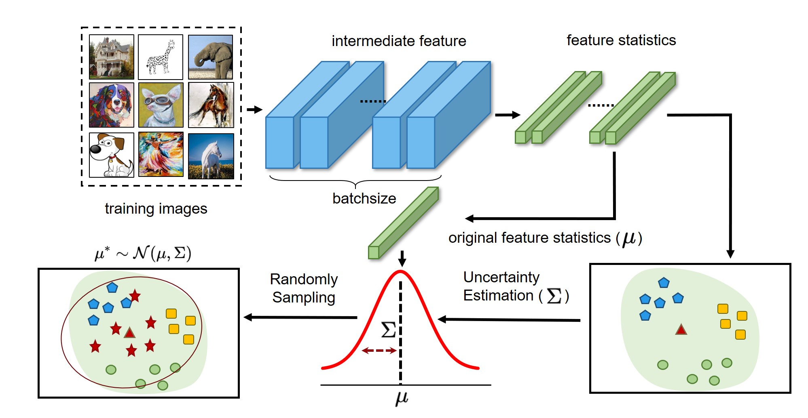

# Uncertainty Modeling for Out-of-Distribution Generalization (DSU)
Official pytorch implementation of "[Uncertainty Modeling for Out-of-Distribution Generalization](https://openreview.net/forum?id=6HN7LHyzGgC)" in International Conference on Learning Representations (__ICLR__) 2022. 

By Xiaotong Li, Yongxing Dai, Yixiao Ge, Jun Liu, Ying Shan, Ling-Yu Duan. 

## Introduction

> In this paper, we improve the network generalization ability by modeling the uncertainty
of domain shifts with synthesized feature statistics during training. Specifically,
we hypothesize that the feature statistic, after considering the potential uncertainties, follows a multivariate Gaussian distribution. Hence, each feature statistic is
no longer a deterministic value, but a probabilistic point with diverse distribution
possibilities. With the uncertain feature statistics, the models can be trained to
alleviate the domain perturbations and achieve better robustness against potential
domain shifts. 



## Requirements

We use the following versions of OS and softwares:

+ OS: Ubuntu 16.04
+ Python: 3.6.8
+ PyTorch: 1.5.0
+ CUDA: 10.1

Following the instructions of individual repositories to install the required environments.
## Experiments
The experiments include: [instance retrieval](instance-retrieval) (person re-identification on DukeMTMC and Market1501), [multi-domain generalization](multi-domain-generalization) (PACS and Office-Home), and [semantic segmentation](semantic-segmentation) (from GTA5 to CityScapes). The core code of our method can be found in [dsu.py](dsu.py)


### Instance Retrieval
+ The detailed instructions to run experiments on instance retrieval can be found at [instance-retrieval-readme.md](./instance-retrieval/instance-retrieval-reamde.md).


### Multi-domain Generalization
+ The detailed instructions to run experiments on multi-domain generalization can be found at [multi-domain-generalization-readme.md](./multi-domain-generalization/multi-domain-generalization-readme.md).


### Semantic Segmentation

+ The detailed instructions to run experiments on semantic segmentation can be found at [semantic-segmentation-readme.md](./semantic-segmentation/semantic-segmentation-readme.md).


## Citation
If you find our work is useful for your research, please kindly cite our paper.
```
@inproceedings{
li2022uncertainty,
title={Uncertainty Modeling for Out-of-Distribution Generalization},
author={Xiaotong Li and Yongxing Dai and Yixiao Ge and Jun Liu and Ying Shan and LINGYU DUAN},
booktitle={International Conference on Learning Representations},
year={2022},
url={https://openreview.net/forum?id=6HN7LHyzGgC}
}
```
## Contact
If you have any questions, you can contact me from the email: lixiaotong@stu.pku.edu.cn
